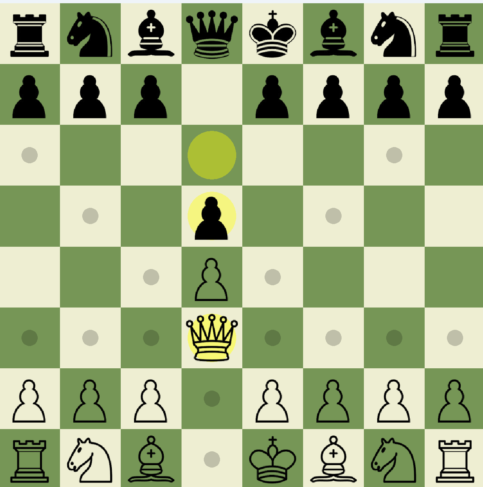
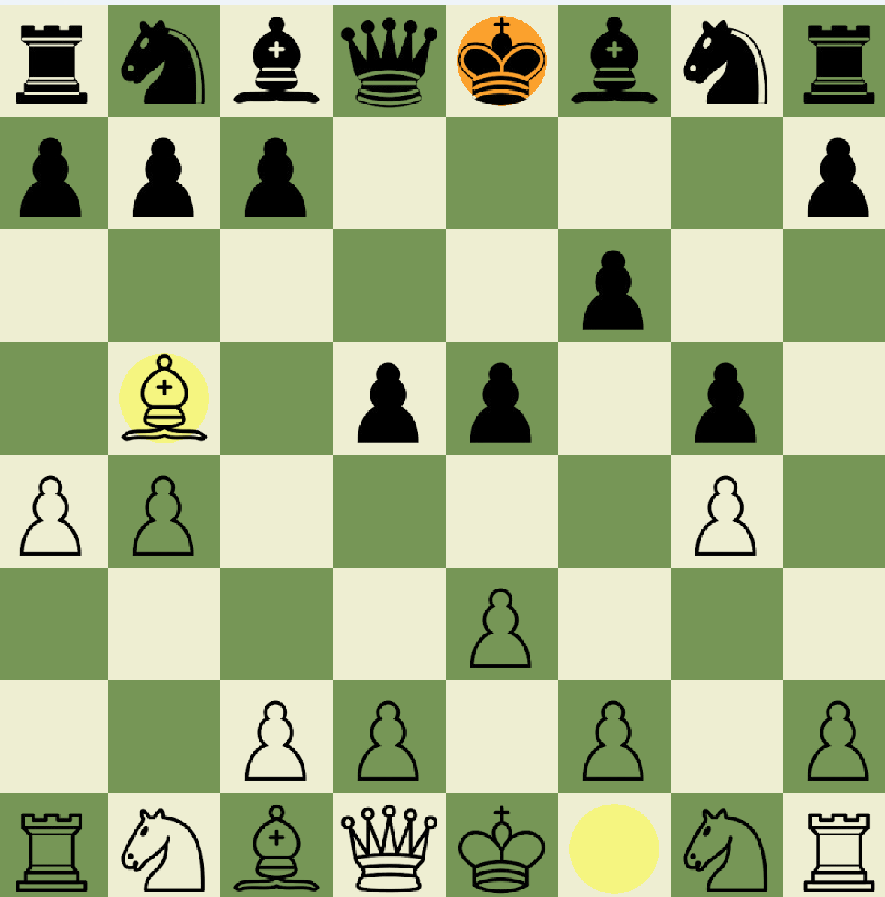
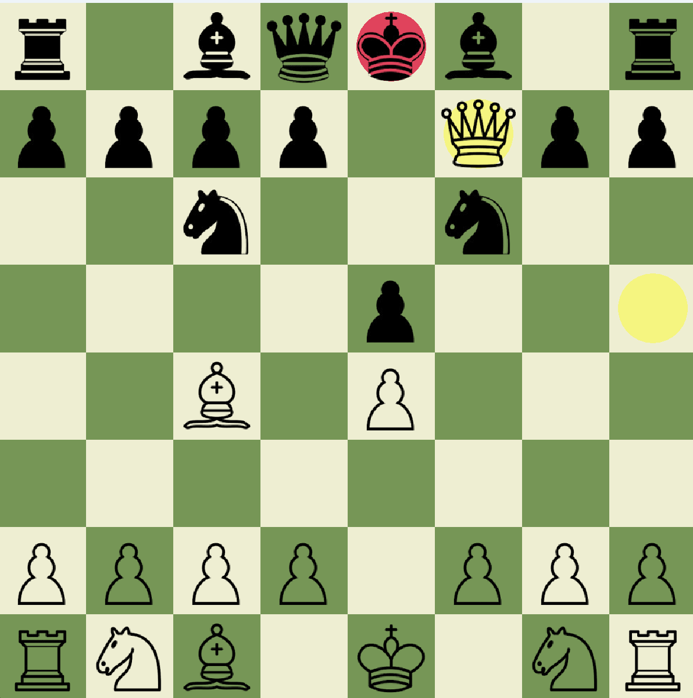

# C++ Bitboard Chess Engine & Minimax AI

A desktop chess engine built entirely in **C++17**, featuring a custom **bitboard-based architecture**, efficient legal move generation, and a **Minimax AI** optimized with **Alpha-Beta pruning**. The project includes a graphical interface built with **SFML 3** and demonstrates advanced use of data structures, algorithms, object-oriented programming, and low-level bit manipulation.

---

## Features

* **Bitboard-Based Chess Engine**

  * Represents the board using multiple **64-bit bitboards (`uint64_t`)**, where each bit corresponds to a square on the chessboard.
  * Performs occupancy checks and move generation using efficient bitwise operations instead of a traditional 8×8 array.
  * Hardware-accelerated bit manipulation using compiler intrinsics.

* **Minimax AI with Alpha-Beta Pruning**

  * Searches multiple plies ahead to determine the strongest move.
  * Uses Alpha-Beta pruning to eliminate unnecessary search branches while preserving optimal move selection.
  * Configurable search depth.

* **Chess Rules**

  * Legal move validation
  * Check detection
  * Checkmate detection
  * Piece captures
  * Turn management
  * Pawn promotion *(currently promoted to Queen only)*

* **Multiple Game Modes**

  * Player vs Player
  * Player vs AI

* **Interactive Graphical Interface**

  * Built using SFML 3
  * Click-to-select movement
  * Legal move highlighting
  * Last move highlighting
  * Check and checkmate indication
  * Smooth AI move delay for improved gameplay experience

---

## Under the Hood

### Bitboard Representation

Instead of storing pieces inside an 8×8 array, the engine represents the board using multiple **64-bit unsigned integers (`uint64_t`)**.

Each piece type is represented by its own bitboard, where every bit corresponds to a square on the chessboard.

This allows many common chess operations to become simple CPU bitwise instructions.

Advantages include:

* Constant-time occupancy checks
* Fast move generation
* Efficient attack calculations
* Compact board representation

Common bitwise operations used throughout the engine include:

* AND (`&`)
* OR (`|`)
* XOR (`^`)
* Left Shift (`<<`)
* Right Shift (`>>`)

---

### Hardware-Accelerated Bit Operations

The engine leverages compiler intrinsics that map directly to CPU instructions for fast bit manipulation.

**MSVC**

* `__popcnt64`
* `_BitScanForward64`

**GCC / Clang**

* `__builtin_popcountll`
* `__builtin_ctzll`

These instructions provide efficient implementations for:

* Population count (number of set bits)
* Least-significant-bit extraction

---

### Minimax + Alpha-Beta Pruning

The AI evaluates future board positions using the **Minimax algorithm**.

Alpha-Beta pruning removes branches that cannot improve the current evaluation, dramatically reducing the search space while producing the same optimal move.

The current evaluation function considers:

* Material balance (centipawn values)
* Checkmate detection
* Legal move availability

The evaluation framework is designed to be extended with additional heuristics such as:

* Piece-square tables
* King safety
* Pawn structure
* Mobility evaluation

---

### Legal Move Validation

Moves are generated in two stages.

1. Generate pseudo-legal moves.
2. Apply each move to a temporary board state.
3. Verify that the moving side's king is not left in check.
4. Retain only legal moves.

This guarantees compliance with official chess movement rules.

---

## Key Concepts Demonstrated

* Bitboard-based board representation
* Bit manipulation using 64-bit integers
* Object-Oriented Programming (OOP)
* Minimax Search
* Alpha-Beta Pruning
* Legal move generation
* Game state management
* GUI programming with SFML
* Modern C++17


---
## Project Structure

```text
Chess-AI/
│
├── assets/              # Piece sprites, fonts, and images
├── include/             # Header files
├── src/                 # Engine implementation
├── CMakeLists.txt
└── README.md
```

---

## Technologies Used

* C++17
* C++ STL
* SFML 3
* CMake
* vcpkg
* Git

---

## Building the Project

### Prerequisites

* C++17 compiler

  * Visual Studio 2022
  * GCC
  * Clang

* CMake 3.15+
* Git
* vcpkg

---

### Clone the Repository

```bash
git clone https://github.com/harshlamba18/chess-ai.git

cd chess-ai
```

---

### Install SFML using vcpkg

#### Windows

```powershell
git clone https://github.com/microsoft/vcpkg.git

.\vcpkg\bootstrap-vcpkg.bat

.\vcpkg\vcpkg install sfml:x64-windows
```

#### Linux / macOS

```bash
git clone https://github.com/microsoft/vcpkg.git

./vcpkg/bootstrap-vcpkg.sh

./vcpkg/vcpkg install sfml
```

---

### Configure CMake

Replace `PATH_TO_VCPKG` with the path to your local vcpkg installation.

```bash
cmake -B build -S . \
-DCMAKE_TOOLCHAIN_FILE=PATH_TO_VCPKG/scripts/buildsystems/vcpkg.cmake
```

---

### Build

```bash
cmake --build build --config Release
```

---

### Run

#### Windows

```powershell
.\build\Release\chess-ai.exe
```

#### Linux / macOS

```bash
./build/chess-ai
```

Ensure that the `assets/` directory is present alongside the executable.

---

## Screenshots

### Main Menu


---

### Legal Move Highlight



---

### Check Position



---

### Checkmate Screen



---
